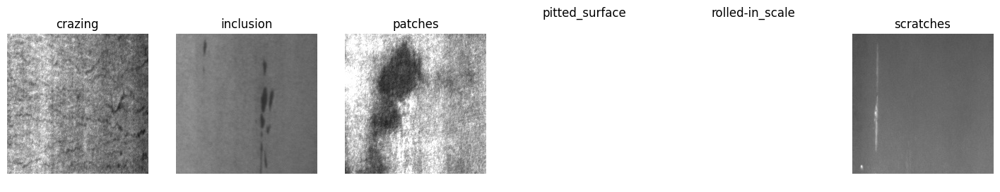
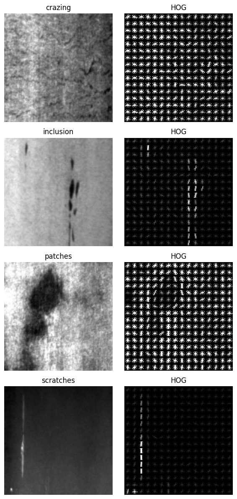
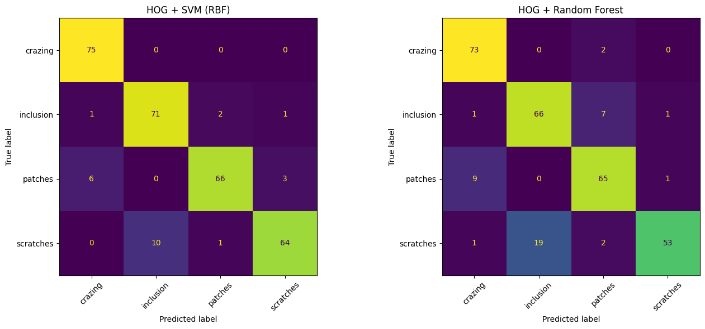
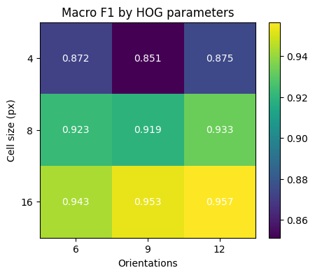

# LAB 05 – HOG-Based Steel Surface Defect Detection

| | |
|---|---|
| **Name** | Khuzaima Ishtiaq |
| **Roll No** | FA23-BAI-029 |
| **Dataset** | NEU Steel Surface Defect (train/valid split), Kaggle |
| **Method** | HOG features + SVM (RBF) and Random Forest |

---

## 1. Install Libraries and Download Dataset

```python
!pip install -q kagglehub scikit-image scikit-learn opencv-python-headless joblib

import kagglehub

# Download latest version
path = kagglehub.dataset_download("sovitrath/neu-steel-surface-defect-detect-trainvalid-split")

print("Path to dataset files:", path)
```

**Output:**

```text
Using Colab cache for faster access to the 'neu-steel-surface-defect-detect-trainvalid-split' dataset.
Path to dataset files: /kaggle/input/neu-steel-surface-defect-detect-trainvalid-split
```

## 2. Load Image Paths and Inspect Folder Layout

```python
import os, glob
import numpy as np
import pandas as pd
import cv2
import matplotlib.pyplot as plt
from collections import Counter
import kagglehub

# Safely check if path is defined in globals; if not, download the dataset
if 'path' not in globals():
    path = kagglehub.dataset_download("sovitrath/neu-steel-surface-defect-detect-trainvalid-split")

IMG_EXTS = ('.jpg', '.jpeg', '.png', '.bmp')
all_imgs = sorted(p for p in glob.glob(os.path.join(path, '**', '*'), recursive=True)
                  if p.lower().endswith(IMG_EXTS))
print('Total images found:', len(all_imgs))

# Show the folder layout (first 3 levels)
for root, dirs, files in os.walk(path):
    depth = root.replace(path, '').count(os.sep)
    if depth <= 3:
        print('  ' * depth + os.path.basename(root) + '/  (%d files)' % len(files))
```

**Output:**

```text
Using Colab cache for faster access to the 'neu-steel-surface-defect-detect-trainvalid-split' dataset.
Total images found: 1800
neu-steel-surface-defect-detect-trainvalid-split/  (0 files)
  valid_images/  (100 files)
  valid_annotations/  (100 files)
  train_images/  (1700 files)
  train_annotations/  (1700 files)
```

## 3. Extract Class Labels

```python
CLASS_NAMES = ['crazing', 'inclusion', 'patches', 'pitted_surface', 'rolled-in_scale', 'scratches']
CODE_TO_CLASS = {'Cr': 'crazing', 'In': 'inclusion', 'Pa': 'patches',
                 'PS': 'pitted_surface', 'RS': 'rolled-in_scale', 'Sc': 'scratches'}

def label_from_path(p):
    parts = [x.lower() for x in os.path.normpath(p).split(os.sep)]
    for name in CLASS_NAMES:
        if name in parts:
            return name
    token = os.path.basename(p).split('_')[0]
    if token in CLASS_NAMES:
        return token
    return CODE_TO_CLASS.get(token)

labelled = [(p, label_from_path(p)) for p in all_imgs]
labelled = [(p, c) for p, c in labelled if c is not None]

print('Labelled defect images:', len(labelled))
print(Counter(c for _, c in labelled))
if not labelled:
    print('No labels found. Sample filenames:', [os.path.basename(p) for p in all_imgs[:10]])
```

**Output:**

```text
Labelled defect images: 1200
Counter({'crazing': 300, 'inclusion': 300, 'patches': 300, 'scratches': 300})
```

## 4. Sample Image from Each Defect Class

```python
# One sample per defect class
fig, axes = plt.subplots(1, len(CLASS_NAMES), figsize=(18, 3))
for ax, cls in zip(axes, CLASS_NAMES):
    matches = [p for p, c in labelled if c == cls]
    if matches:
        ax.imshow(cv2.cvtColor(cv2.imread(matches[0]), cv2.COLOR_BGR2RGB))
    ax.set_title(cls)
    ax.axis('off')
plt.show()
```

**Output:**



*Figure: Sample image from each defect class*

## 5. Load, Convert to Grayscale and Resize Images

```python
NORMAL_SOURCE = None  # e.g. '/content/normal_images'
IMG_SIZE = (128, 128)

def load_gray(p, size=IMG_SIZE):
    img = cv2.imread(p, cv2.IMREAD_GRAYSCALE)
    if img is None:
        return None
    return cv2.resize(img, size, interpolation=cv2.INTER_AREA)

images, labels = [], []
for p, c in labelled:
    im = load_gray(p)
    if im is not None:
        images.append(im)
        labels.append(c)

if NORMAL_SOURCE and os.path.isdir(NORMAL_SOURCE):
    for p in glob.glob(os.path.join(NORMAL_SOURCE, '**', '*'), recursive=True):
        if p.lower().endswith(IMG_EXTS):
            im = load_gray(p)
            if im is not None:
                images.append(im)
                labels.append('normal')

X_imgs = np.array(images)
y = np.array(labels)
HAS_NORMAL = 'normal' in set(y)
print('Image array:', X_imgs.shape)
print('Class counts:', Counter(y))
if not HAS_NORMAL:
    print('No defect-free class. Running six-class defect classification; set NORMAL_SOURCE for the binary task.')
```

**Output:**

```text
Image array: (1200, 128, 128)
Class counts: Counter({np.str_('crazing'): 300, np.str_('inclusion'): 300, np.str_('patches'): 300, np.str_('scratches'): 300})
No defect-free class. Running six-class defect classification; set NORMAL_SOURCE for the binary task.
```

## 5b. HOG Feature Extraction and Visualization

```python
from skimage.feature import hog
from skimage import exposure

CELL, ORIENT, BLOCK = 8, 9, 2

def extract_hog(images, cell=CELL, orient=ORIENT, block=BLOCK):
    return np.array([hog(im, orientations=orient,
                         pixels_per_cell=(cell, cell),
                         cells_per_block=(block, block),
                         block_norm='L2-Hys', feature_vector=True)
                     for im in images])

# Representative image per class, with its HOG visualization
rep_idx = [int(np.where(y == cls)[0][0]) for cls in np.unique(y)]
fig, axes = plt.subplots(len(rep_idx), 2, figsize=(6, 3 * len(rep_idx)))
for row, i in enumerate(rep_idx):
    _, hog_img = hog(X_imgs[i], orientations=ORIENT, pixels_per_cell=(CELL, CELL),
                     cells_per_block=(BLOCK, BLOCK), visualize=True)
    hog_img = exposure.rescale_intensity(hog_img, in_range=(0, 10))
    axes[row, 0].imshow(X_imgs[i], cmap='gray'); axes[row, 0].set_title(y[i]); axes[row, 0].axis('off')
    axes[row, 1].imshow(hog_img, cmap='gray'); axes[row, 1].set_title('HOG'); axes[row, 1].axis('off')
plt.tight_layout(); plt.show()
```

**Output:**



*Figure: Representative image per class with its HOG visualization*

## 6. Stratified train/test split

```python
from sklearn.model_selection import train_test_split

Xtr_i, Xte_i, ytr, yte = train_test_split(X_imgs, y, test_size=0.25, stratify=y, random_state=42)
print('Train:', Xtr_i.shape, ' Test:', Xte_i.shape)
```

**Output:**

```text
Train: (900, 128, 128)  Test: (300, 128, 128)
```

## 7. Train HOG + SVM and HOG + Random Forest

Metrics are macro-averaged across classes. When a defect-free class exists, binary Defective / Non-Defective metrics are added.

```python
from sklearn.svm import SVC
from sklearn.ensemble import RandomForestClassifier
from sklearn.preprocessing import StandardScaler
from sklearn.pipeline import make_pipeline
from sklearn.metrics import (accuracy_score, precision_recall_fscore_support,
                             confusion_matrix, classification_report, ConfusionMatrixDisplay)

def binary_scores(y_true, y_pred):
    bt = (np.asarray(y_true) != 'normal').astype(int)
    bp = (np.asarray(y_pred) != 'normal').astype(int)
    p, r, f, _ = precision_recall_fscore_support(bt, bp, average='binary', zero_division=0)
    return {'Binary Accuracy': accuracy_score(bt, bp), 'Binary Precision': p,
            'Binary Recall': r, 'Binary F1': f}

def score(y_true, y_pred):
    p, r, f, _ = precision_recall_fscore_support(y_true, y_pred, average='macro', zero_division=0)
    out = {'Accuracy': accuracy_score(y_true, y_pred), 'Macro Precision': p,
           'Macro Recall': r, 'Macro F1': f}
    if HAS_NORMAL:
        out.update(binary_scores(y_true, y_pred))
    return out

def build_models():
    return {
        'HOG + SVM (RBF)': make_pipeline(StandardScaler(),
                                         SVC(kernel='rbf', C=10, gamma='scale', probability=True, random_state=42)),
        'HOG + Random Forest': RandomForestClassifier(n_estimators=300, random_state=42, n_jobs=-1),
    }

Xtr = extract_hog(Xtr_i)
Xte = extract_hog(Xte_i)
print('HOG feature length:', Xtr.shape[1])

results = {}
for name, model in build_models().items():
    model.fit(Xtr, ytr)
    y_pred = model.predict(Xte)
    results[name] = {'model': model, 'pred': y_pred, 'metrics': score(yte, y_pred)}

summary = pd.DataFrame({k: v['metrics'] for k, v in results.items()}).T.round(4)
summary
```

**Output:**

```text
HOG feature length: 8100
```

**Output:**

|  | Accuracy | Macro Precision | Macro Recall | Macro F1 |
| --- | --- | --- | --- | --- |
| **HOG + SVM (RBF)** | 0.9200 | 0.9222 | 0.9200 | 0.9194 |
| **HOG + Random Forest** | 0.8567 | 0.8661 | 0.8567 | 0.8549 |

## 8. Confusion matrix and classification report

```python
labels_order = sorted(set(y))
fig, axes = plt.subplots(1, len(results), figsize=(7 * len(results), 6))
for ax, (name, r) in zip(np.atleast_1d(axes), results.items()):
    cm = confusion_matrix(yte, r['pred'], labels=labels_order)
    ConfusionMatrixDisplay(cm, display_labels=labels_order).plot(ax=ax, colorbar=False, xticks_rotation=45)
    ax.set_title(name)
plt.tight_layout(); plt.show()

for name, r in results.items():
    print('=' * 70)
    print(name)
    print(classification_report(yte, r['pred'], labels=labels_order, zero_division=0))
```

**Output:**



*Figure: Confusion matrices: HOG + SVM (left) and HOG + Random Forest (right)*

**Output:**

```text
======================================================================
HOG + SVM (RBF)
              precision    recall  f1-score   support

     crazing       0.91      1.00      0.96        75
   inclusion       0.88      0.95      0.91        75
     patches       0.96      0.88      0.92        75
   scratches       0.94      0.85      0.90        75

    accuracy                           0.92       300
   macro avg       0.92      0.92      0.92       300
weighted avg       0.92      0.92      0.92       300

======================================================================
HOG + Random Forest
              precision    recall  f1-score   support

     crazing       0.87      0.97      0.92        75
   inclusion       0.78      0.88      0.82        75
     patches       0.86      0.87      0.86        75
   scratches       0.96      0.71      0.82        75

    accuracy                           0.86       300
   macro avg       0.87      0.86      0.85       300
weighted avg       0.87      0.86      0.85       300
```

## 9. HOG parameter sweep: cell size and orientations

Cell sizes 4, 8, 16 and orientations 6, 9, 12, with an SVM retrained for each combination on the same split. Smaller cells give longer feature vectors and take longer to compute.

```python
sweep_rows = []
for cell in [4, 8, 16]:
    for orient in [6, 9, 12]:
        Ftr = extract_hog(Xtr_i, cell, orient)
        Fte = extract_hog(Xte_i, cell, orient)
        clf = make_pipeline(StandardScaler(), SVC(kernel='rbf', C=10, gamma='scale'))
        clf.fit(Ftr, ytr)
        m = score(yte, clf.predict(Fte))
        sweep_rows.append({'cell': cell, 'orient': orient, 'n_features': Ftr.shape[1], **m})

sweep_df = pd.DataFrame(sweep_rows)
sweep_df.round(4)
```

**Output:**

| cell | orient | n_features | Accuracy | Macro Precision | Macro Recall | Macro F1 |
| --- | --- | --- | --- | --- | --- | --- |
| 4 | 6 | 23064 | 0.8733 | 0.8810 | 0.8733 | 0.8722 |
| 4 | 9 | 34596 | 0.8533 | 0.8627 | 0.8533 | 0.8512 |
| 4 | 12 | 46128 | 0.8767 | 0.8914 | 0.8767 | 0.8745 |
| 8 | 6 | 5400 | 0.9233 | 0.9257 | 0.9233 | 0.9226 |
| 8 | 9 | 8100 | 0.9200 | 0.9222 | 0.9200 | 0.9194 |
| 8 | 12 | 10800 | 0.9333 | 0.9387 | 0.9333 | 0.9330 |
| 16 | 6 | 1176 | 0.9433 | 0.9460 | 0.9433 | 0.9430 |
| 16 | 9 | 1764 | 0.9533 | 0.9552 | 0.9533 | 0.9532 |
| 16 | 12 | 2352 | 0.9567 | 0.9579 | 0.9567 | 0.9566 |

```python
pivot = sweep_df.pivot(index='cell', columns='orient', values='Macro F1')
fig, ax = plt.subplots(figsize=(5, 4))
im = ax.imshow(pivot.values, cmap='viridis')
ax.set_xticks(range(len(pivot.columns))); ax.set_xticklabels(pivot.columns)
ax.set_yticks(range(len(pivot.index))); ax.set_yticklabels(pivot.index)
ax.set_xlabel('Orientations'); ax.set_ylabel('Cell size (px)')
for i in range(pivot.shape[0]):
    for j in range(pivot.shape[1]):
        ax.text(j, i, f'{pivot.values[i, j]:.3f}', ha='center', va='center', color='w')
ax.set_title('Macro F1 by HOG parameters')
plt.colorbar(im); plt.show()
```

**Output:**



*Figure: Macro F1 by HOG cell size and orientations*

## 10. Robustness analysis

The model is trained on clean images. Each perturbation is applied to the test set only. Changes are reported against the clean baseline.

```python
rng = np.random.default_rng(42)

def brightness(im, f):
    return np.clip(im.astype(np.float32) * f, 0, 255).astype(np.uint8)

def gaussian_noise(im, sigma=20):
    return np.clip(im.astype(np.float32) + rng.normal(0, sigma, im.shape), 0, 255).astype(np.uint8)

def rotate(im, angle=15):
    h, w = im.shape
    M = cv2.getRotationMatrix2D((w / 2, h / 2), angle, 1.0)
    return cv2.warpAffine(im, M, (w, h), borderMode=cv2.BORDER_REFLECT)

def blur(im, k=5):
    return cv2.GaussianBlur(im, (k, k), 0)

conditions = {
    'Clean': lambda x: x,
    'Brightness x0.6': lambda x: brightness(x, 0.6),
    'Brightness x1.4': lambda x: brightness(x, 1.4),
    'Gaussian noise (sigma=20)': lambda x: gaussian_noise(x, 20),
    'Rotation 15 deg': lambda x: rotate(x, 15),
    'Blur 5x5': lambda x: blur(x, 5),
}

best_name = max(results, key=lambda k: results[k]['metrics']['Macro F1'])
best = results[best_name]['model']
print('Robustness test on:', best_name)

rows = []
for cname, fn in conditions.items():
    Xc = extract_hog(np.array([fn(im) for im in Xte_i]))
    rows.append({'condition': cname, **score(yte, best.predict(Xc))})

rob = pd.DataFrame(rows)
base = rob.iloc[0]
rob['Δ Accuracy'] = rob['Accuracy'] - base['Accuracy']
rob['Δ Macro F1'] = rob['Macro F1'] - base['Macro F1']
rob[['condition', 'Accuracy', 'Macro F1', 'Δ Accuracy', 'Δ Macro F1']].round(4)
```

**Output:**

```text
Robustness test on: HOG + SVM (RBF)
```

**Output:**

| condition | Accuracy | Macro F1 | Δ Accuracy | Δ Macro F1 |
| --- | --- | --- | --- | --- |
| Clean | 0.9200 | 0.9194 | 0.0000 | 0.0000 |
| Brightness x0.6 | 0.9100 | 0.9100 | -0.0100 | -0.0093 |
| Brightness x1.4 | 0.6667 | 0.6616 | -0.2533 | -0.2577 |
| Gaussian noise (sigma=20) | 0.2567 | 0.1144 | -0.6633 | -0.8050 |
| Rotation 15 deg | 0.8667 | 0.8675 | -0.0533 | -0.0519 |
| Blur 5x5 | 0.3033 | 0.1945 | -0.6167 | -0.7248 |

## 11. Industrial quality-control decision module

```python
def inspect_product(image_path, model=best, cell=CELL, orient=ORIENT):
    im = load_gray(image_path)
    if im is None:
        raise ValueError('Could not read image: ' + image_path)
    proba = model.predict_proba(extract_hog([im], cell, orient))[0]
    classes = list(model.classes_)
    top = int(np.argmax(proba))
    pred_label = classes[top]

    if HAS_NORMAL:
        p_defect = 1 - proba[classes.index('normal')]
        is_defective = p_defect >= 0.5
        confidence = p_defect if is_defective else 1 - p_defect
    else:
        is_defective = True  # no defect-free class exists in NEU-DET
        confidence = proba[top]

    print('PRODUCT INSPECTION RESULT')
    print('Prediction:', 'DEFECTIVE' if is_defective else 'NON-DEFECTIVE')
    print(f'Confidence: {confidence * 100:.0f}%')
    print('Action:', 'REJECT PRODUCT' if is_defective else 'ACCEPT PRODUCT')
    if is_defective:
        print('Defect type:', pred_label)

if labelled:
    inspect_product(labelled[0][0])
```

**Output:**

```text
PRODUCT INSPECTION RESULT
Prediction: DEFECTIVE
Confidence: 100%
Action: REJECT PRODUCT
Defect type: crazing
```

## 12. Save the model

If you change `CELL` and `ORIENT` to the best values from section 9, rerun section 7 first so the saved model matches.

```python
import joblib
joblib.dump({'model': best, 'cell': CELL, 'orient': ORIENT,
             'img_size': IMG_SIZE, 'has_normal': HAS_NORMAL}, 'hog_defect_model.joblib')
print('Saved hog_defect_model.joblib')
```

**Output:**

```text
Saved hog_defect_model.joblib
```

## 13. Bonus: real-time webcam prototype (run locally, not in Colab)

Colab has no camera access. The cell below writes `realtime_inspect.py`, which you run on a laptop with a webcam after downloading `hog_defect_model.joblib`. For a real inspection line, point the camera at a steel surface under fixed lighting.

```python
%%writefile realtime_inspect.py
import cv2
import joblib
from skimage.feature import hog

bundle = joblib.load('hog_defect_model.joblib')
model, cell, orient = bundle['model'], bundle['cell'], bundle['orient']

cap = cv2.VideoCapture(0)
while True:
    ok, frame = cap.read()
    if not ok:
        break
    gray = cv2.cvtColor(frame, cv2.COLOR_BGR2GRAY)
    gray = cv2.resize(gray, bundle['img_size'], interpolation=cv2.INTER_AREA)
    feat = hog(gray, orientations=orient, pixels_per_cell=(cell, cell),
               cells_per_block=(2, 2), block_norm='L2-Hys', feature_vector=True)
    pred = model.predict([feat])[0]
    if bundle['has_normal'] and pred == 'normal':
        label, color = 'PASS', (0, 255, 0)
    else:
        label, color = 'DEFECTIVE', (0, 0, 255)
    cv2.putText(frame, label, (20, 50), cv2.FONT_HERSHEY_SIMPLEX, 1.5, color, 3)
    cv2.imshow('Inspection', frame)
    if cv2.waitKey(1) & 0xFF == ord('q'):
        break
cap.release()
cv2.destroyAllWindows()
```

**Output:**

```text
Writing realtime_inspect.py
```

---

## Summary of Results

- **Dataset:** 1,200 labelled images (300 each of crazing, inclusion, patches, scratches), resized to 128×128 grayscale; 900 train / 300 test (stratified).
- **Best baseline model:** HOG + SVM (RBF) with accuracy 0.9200 and macro F1 0.9194, ahead of HOG + Random Forest (accuracy 0.8567, macro F1 0.8549).
- **HOG parameter sweep:** the best setting was cell size 16 with 12 orientations (accuracy 0.9567, macro F1 0.9566) using only 2,352 features; cell size 4 was the weakest (macro F1 0.8512 to 0.8745) and the slowest.
- **Robustness:** the SVM held up under brightness x0.6 (-0.0100 accuracy) and 15° rotation (-0.0533), but degraded sharply under brightness x1.4 (-0.2533), Gaussian noise (-0.6633) and 5x5 blur (-0.6167).
- **Note:** the dataset has no defect-free class, so the binary Defective / Non-Defective metrics were not computed.

---

**Submitted by:** Khuzaima Ishtiaq (FA23-BAI-029)
